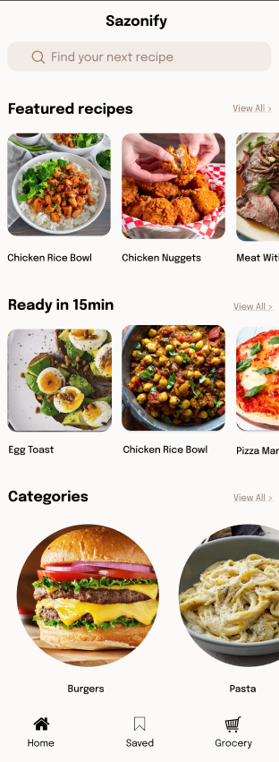
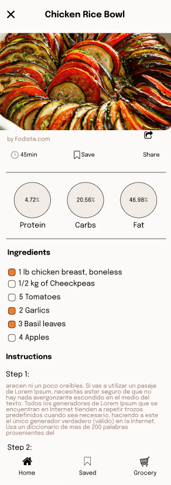
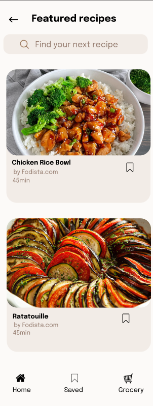
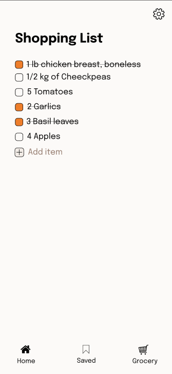

# 🍳 Sazonify

**Sazonify** is a recipe application that helps you explore, search for, and discover new culinary ideas. With features such as category searches, sorting by popularity, and personalized results, this app leverages the Spoonacular API to provide a complete culinary experience.

---

## 🚀 Features

### **Home Screen**  
- **Recipes by Category:** Explore recipes for breakfast, lunch, desserts, and more.  
- **Popular Recipes:** Discover the most popular recipes based on Spoonacular data.  
- **Quick Recipes:** Find recipes that you can prepare in 15 minutes or less.  
- **Ingredient Search:** Enter the ingredients you have at home and get relevant recipes.  

### **Detail Screen**  
- Full recipe details, including ingredients, preparation steps, and total time.  

### **Search Screen**  
- **Smart Search:** Find recipes using keywords, ingredients, or cuisine preferences.  
- **Advanced Filters:** Filter results by cooking time, difficulty level, and dietary preferences.  
- **Search History:** Quickly access previously searched recipes.  

### **Grocery Screen**  
- **Shopping List:** Automatically generate a grocery list based on selected recipes.  
- **Ingredient Management:** Add, remove, or check off ingredients as you shop.  

---

## 🖼️ Screenshots

<div align="center">

### Home Screen


### Detail Screen


### Search Screen


### Grocery Screen


</div>


## 🛠️ Technologies Used

### Frontend:
- **Kotlin:** Main programming language for the app.
- **Jetpack Compose:** Modern declarative UI framework for Android.
- **Navigation Compose:** Declarative navigation between screens.

### Backend/API:
- **Retrofit:** For making API calls and handling HTTP networking.
- **OkHttp:** For network logging and intercepting HTTP requests.
- **Kotlin Coroutines:** For asynchronous programming and handling background tasks.
- **Room:** Local data persistence with a simple abstraction over SQLite.

### Key Dependencies:
- **Hilt:** Dependency injection framework to manage and provide app-wide dependencies.
- **Coil:** Image loading library optimized for Android and Compose.
- **Kotlinx Serialization:** For JSON serialization and deserialization.

---

## 🏗️ Architecture

- **MVVM (Model-View-ViewModel):** Clear separation between business logic and UI.
- **Repository Pattern:** To handle API calls.
- **StateFlow:** To manage reactive states and real-time updates.

---

## 🔧 Setup

### Step 1: Clone this Repository
```bash
git clone https://github.com/your-username/sazonify.git
```

### Step 2: Obtain a Spoonacular API Key
1. Go to [Spoonacular API](https://spoonacular.com/food-api).
2. Sign up and log in.
3. Create a new project and copy your API key.

---
### Step 3: Configure the API Key
1. Open the `local.properties` file (create one if it doesn't exist).
2. Add your key:
   ```properties
   SPOONACULAR_API_KEY=your_api_key_here
### Step 4: Set Up Environment Variables (Optional)

If you prefer to use environment variables, follow these steps:

#### Mac/Linux:
```bash
export SPOONACULAR_API_KEY=your_api_key_here
```

#### Windows:
```cmd
set SPOONACULAR_API_KEY=your_api_key_here
```

### Step 5: Run the App

1. Open the project in Android Studio.
2. Connect a device or emulator.
3. Press **Run**.

---

## 🌟 Upcoming Features

- Save recipes as favorites.
- Dark mode.
- Automatically generated shopping list.
- Multi-language support.

---

## 📜 License

This project is licensed under the MIT License. See the `LICENSE` file for more details.

---

## 🤝 Contributions

Contributions, issues, and feature requests are welcome! To contribute:

1. Fork the project.
2. Create a new branch:
   ```bash
   git checkout -b my-new-feature
   ```
3. Make your changes and commit:
   ```bash
   git commit -m 'Add new feature'
   ```
4. Push your changes to your fork:
   ```bash
   git push origin my-new-feature
   ```
5. Create a Pull Request.

---

## ✨ Credits

- **API:** [Spoonacular API](https://spoonacular.com/food-api)
- **Developer:** Fernando González Laso


